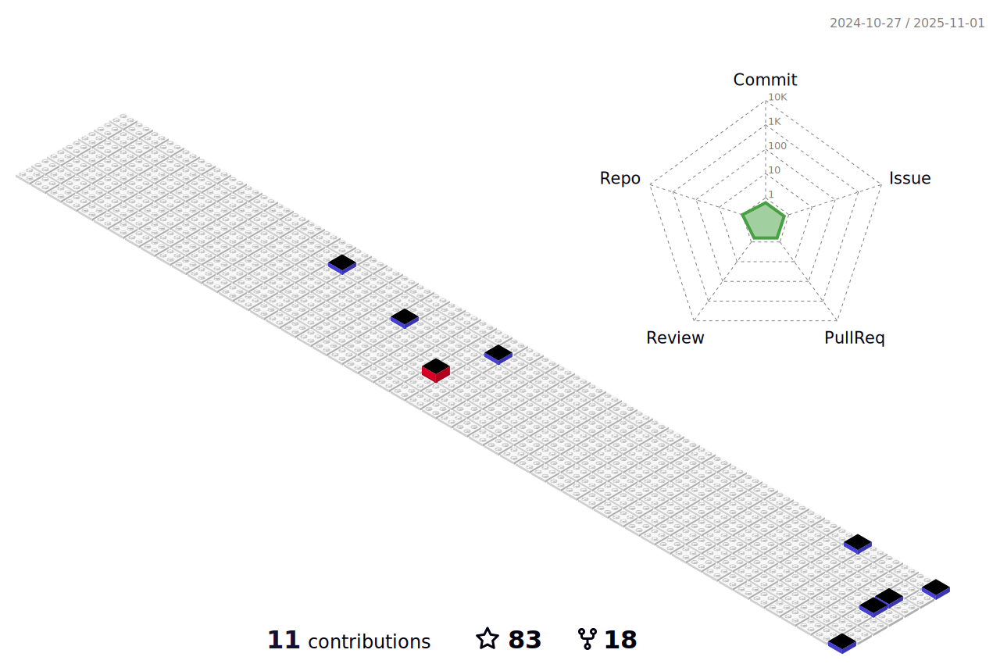

<h2 align="center">Hi 👋! My name is Can and I'm a Front-end Developer with React skills</h2>
<!--

-->

### 

###

<!--
###

  
  

-->

###
 

<h2 align="center"> My projects</h2>

###

  Project Demo       |Libraries and Technologies I use     |Project Preview   
:-------------------------|-------------------------|-------------------------
[React Schiphol Airport Flights App](https://reliable-chimera-0baadb.netlify.app/) <h3>[Repo](https://github.com/canocalir/schipol-metrics)</h3> | ReactJS, Styled Components, React Toastify, Official Schipol Api |
[React Firebase Movie App](https://musical-moonbeam-a4cdde.netlify.app/) <h3>[Repo](https://github.com/canocalir/movie-database)</h3> | ReactJS, Styled Components, Firebase Authentication, Flowbite React, The Movie Database Api, React Toastify |
[React Turkey Earthquake App](https://chimerical-eclair-cd9cee.netlify.app/) <h3>[Repo](https://github.com/canocalir/earthquake-app)</h3> | ReactJS, Pigeon Maps, SASS Modules |
[React Recipe App](https://prismatic-duckanoo-10bdd4.netlify.app/login) <h3>[Repo](https://github.com/canocalir/recipe-app)</h3> | ReactJS, React Router, Styled Components, SASS Modules |
[React Pokemon App](https://dulcet-chimera-3865aa.netlify.app/) <h3>[Repo](https://github.com/canocalir/pokemon-test)</h3> | ReactJS, React Router, SASS |
[React Dashboard Example App(Task)](https://immfly-frontend-test.herokuapp.com/) <h3>[Repo](https://github.com/canocalir/immflyfrontend)</h3> | ReactJS, CSS |
[React Developer News App](https://canocalir.github.io/popular-news/) <h3>[Repo](https://github.com/canocalir/popular-news)</h3> | ReactJS, CSS |
[React Ingredient Recognition App](https://carty-food-recognition.herokuapp.com/) <h3>[Repo](https://github.com/canocalir/carty-frontend)</h3> | ReactJS, CSS |
[React Pricing Table App](https://rainbow-creponne-a8121c.netlify.app/) <h3>[Repo](https://github.com/canocalir/react-pricing-table)</h3> | ReactJS, CSS |
[React Random User App](https://resilient-brioche-95a033.netlify.app/) <h3>[Repo](https://github.com/canocalir/random-user-app)</h3> | ReactJS, SASS Module |
[React Employee List App](https://sensational-quokka-924ea3.netlify.app/) <h3>[Repo](https://github.com/canocalir/employee-list)</h3> | ReactJS, SASS Module |
[React Image Gallery App](https://enchanting-buttercream-af6c58.netlify.app/) <h3>[Repo](https://github.com/canocalir/image-gallery)</h3> | ReactJS, PureCSS |
[React Tour Places Gallery App](https://main--jovial-taiyaki-38ff24.netlify.app/) <h3>[Repo](https://github.com/canocalir/tour-points)</h3> | ReactJS, SASS |
[Vanilla JS Weather App](https://exquisite-sfogliatella-fd758b.netlify.app/) <h3>[Repo](https://github.com/canocalir/vanillaJS-weather-app)</h3> | Vanilla JS, Pure CSS, OpenWeatherAPI |
[Vanilla JS Riot Games Task](https://eloquent-donut-64fe03.netlify.app/) <h3>[Repo](https://github.com/canocalir/riot-frontend)</h3> | Vanilla JS, CSS |
[Vanilla JS Todo App](https://strong-valkyrie-8f34a3.netlify.app/) <h3>[Repo](https://github.com/canocalir/vanilla-todo-app)</h3> | Vanilla JS, PureCSS, Sweet Alert |
[Vanilla JS Clock](https://fascinating-dieffenbachia-754712.netlify.app/) <h3>[Repo](https://github.com/canocalir/javascript-clock)</h3> | Vanilla JS, CSS |
[Vanilla JS Shopping Cart App](https://radiant-beignet-2754fa.netlify.app/) <h3>[Repo](https://github.com/canocalir/checkout-page-functional)</h3> | Vanilla JS, SASS |
[Vanilla JS Calculator App](https://meek-biscotti-bec27e.netlify.app/) <h3>[Repo](https://github.com/canocalir/VanillaJS-Calculator)</h3> | Vanilla JS, PureCSS |
[Netflix Clone CSS](https://golden-dieffenbachia-777dd8.netlify.app/) <h3>[Repo](https://github.com/canocalir/netflix-landing-clone)</h3> | HTML, PureCSS |
[Google Clone CSS](https://sensational-mermaid-cb0764.netlify.app/) <h3>[Repo](https://github.com/canocalir/google-landing-clone)</h3> | HTML, PureCSS |
[AirBnb Clone CSS](https://melodic-lokum-a77b83.netlify.app/) <h3>[Repo](https://github.com/canocalir/airbnb-clone)</h3> | HTML, PureCSS |
[Team Members CSS](https://fluffy-semifreddo-8f3261.netlify.app/) <h3>[Repo](https://github.com/canocalir/team-members)</h3> | HTML, PureCSS |

 
<h2 align="center">My Tech Stack</h2>

###

<img align="right" height="150" src="data:image/jpeg;base64,/9j/4AAQSkZJRgABAQAAAQABAAD/2wCEAAoHCBINEhISEhIPEhIMDw8PDw8KDxEJChAZJSEnJyUhJCQpLjwlKSw4LSQkKzo0ODE1NzdDKDE8WUg1PzxCNzUBDAwMEA8PGBESGDEdGh4xMTQ/MT80NT8/NDExND80PzExPzQxMT8/ND8/Pz80Pz84Oj80Pz89NDQ/PzExNTE0NP/AABEIAMgAyAMBIgACEQEDEQH/xAAcAAABBAMBAAAAAAAAAAAAAAAAAQIDBQQGBwj/xAA2EAACAQIEAwUHAwQDAQAAAAABAgADEQQSITEFBkETIlFhcQcycoGRobEUQlIzYsHwI9Hhgv/EABoBAAIDAQEAAAAAAAAAAAAAAAABAgMEBQb/xAAnEQADAAICAgEEAQUAAAAAAAAAAQIDERIhBDFBBRMiUWEUMnGRsf/aAAwDAQACEQMRAD8A6EFEMohFhsgFhFAiRTAkOhG3joERLRcoMXNARgN7MRcsUQjATs4gp2kl4AwAYUgKceY4GC2IjyGKEMkvAGMCJlMAh/ElaKDEMjIPhEtJhCPYiMCLa8kEWHICPKYASSEWxkNbVW+FvxCSVR3W+FvxCMDDiwhIIAjogEDAAELxIojABpHrGgRRABTEgdYh0jEOjhGiLtAYsWJeKI0wCOAjY+ABaEIAwIiiELwUwGOhC8LwGEICLABtX3G+FvxCJW91vhb8QgBi2jatRUF2IUDcsQojMU7LTYpYsqkqDsTONcZ4xicQ5FV27pIyDuIJTV8TZ4nivPvvSR0jH834WgcobtDc/wBPvCY+C5pFZ/2qmuh96csD2/3WS0MUwOkp+5R1V9PxKdL2d0oVVqKGU3DWks53ynzJUV1pvqjWUNoMpnRLggEdZfFcls43k4Kw1p+hRAwAgZYZxAYsSKoiAIR1oBYwFEUCEUQQAI68aI4CMQQMIXgILRQYgMVYhgDFgIsBgIsQRY0Ayv7r/A34hCt7rfA34hADl2C5/ZFtUplzrlZTaapx/iiYmoai0xTzbjQzCuJGaec72mPe/Z6acMw24XbIhWmTTYHaMWgLx+QLtE+PwWwrXbMzD1chBuflcTofJvMXbH9PUPeUf8bEklxOYZjMzD1npsjobMhBVhoYTTli8jBOaNP2d4EQiVHLXFhjaKsbCooCuvW8uJrT2tnl8kOKc17QyPAtEMURkQgJg8S4vh8EM1eqlMaAGobTW+J+0bA0AezqCsQCQKV9dtNvP7GAG5RlfE06Kl6joiru1RhTQfMzinFvadja5YUcmHQ+7kQVa9vU6faahicfWrktUqVKhLFiartU18dYINHpbCcRo4gXp1EqA7GmwcGZd55kwfFq2HuKdQqDY2sGsfEX2M27l/2jYygypWIxFM2X/kASsv8A9Df5xi0dtif+ys4Jx3D8QDGhUDmmVDrlKMt/X0MtIgACOAiAxbxjAGEQbx1ogAQgICMBtb3W+FvxCFUd1vgb8QgB5tOwMVXIuBEsLQKZbTL0ejXL2ianUjxrMPORMqiwMhU/JfiycvxZMqx5bL6RAbRGN5A1666Ng5Y4+2CqKd6dQgONyB4zrlGoKihlIIYAqRqJwSih+U6LyBxg2/TVDe39Ik6+kux1p6ZyPqPicp+7K7Xs3m0wOO8VTh2HqYipfLRW+VbZnJ0AHqZZWnOvbMjnCUCt+zGJGe17e6bX+81HBOT8b4tUx9d69QkmoxKrclVHRR5CYIjRrJES8hsloQCPVf8AeszMNgy1hY6/Sbly7ymuIszC4FtDdbyus0yXz49Ut+kaEQfCOSoUIYaFTedU49yMKlMGiFV0B0tlD6TllekyOyMCGQkFWBVgZKMnL0V5MfE6D7NeKp26IDkqVG771HJFQW0UDb/2djAnm/lXF/pcZhambKEroHJ2yk2b7Ez0ku0t0U6EgY6FohhAm0LRCguD1F9YwFBhFtFtACOr7rfC34hHVfcb4W/EICPN64c9Y84UnW+kntJU90i28wcmz2CwylornoW21iKCsy2HlGuhMkq/ZCsKXciI95KomMqkGZiGRZbiptaY6lpM/DYpqDrUpmzIQwMr2fwjqD6i+19YJltJNafo7Ty9xZMdRWoCM9gHX9ymM5qwyVsFi1ZQy/pqzWbxCkg/USh5L4M9O1cOFSoosqa5x5zcMTRFWm6NqtVGRhtoRYzZDbns8j5cTGalL2jy3STr4zJpJqJJjMKcPUqUm96hUek19NQbf4jUaQoeNI2PhGHzkDpcCdR4HRWkgGl9NN5yrhOMKEAb3FhOo8EpsEDufesbeE59TXM6mRr7S0zaKVIMBpvacW9qPCVwuNLp7uJRahHS40P4nb8Abi80X2q8vvXoHEoVP6a7MrDvZTvb7TowtJM5NvbaOLT0hytiTXwWEqMbtUw1FmPicovPPXD8E2Lq06KaNWdULWuFBOpt5T0By5SXCp+hBZjw9Ka9o9gHDC4MsqltIrUNptL0XQjHxKKbE2I+kc7BASbCwOp2ms42rqzg3zHzKxU9E8OH7j0zZ6VQP7pB9JIUI6f5mq8Kxb0iLC5dwLnwmx4bHgklyAA7IDsto5e0Sy+PUvrsmGkcJGuIWrYrb06x+8ZnqWnpjavuN8LfiEKvut8LfiECJwTHYbI9ha3SxvaWfBOyWnWVyudkXIallA8Zr+L4oNFUXI6zCr1Cw3Nz4aCY1L2esyZ5ctJ7aLTEuisyAqQGIuLG8Yig9ZTp5yenUKwqBY/K5e0ZlReoiKYCpmG0Y6mQ/hmhvX5ImSxkqACYqScPDRKa37No5d5qqYBTTK9pTJuFYkFfSXL8/VD7tJB8TEzQVaODXjWSl0V14WC65Uu2YnOeOXE4o1ggRqyIagT3WYaX+gEpaNRTubecs+N0syhuq6X8pSMhBvqPvNEvlPZwPLx/ZzNSui4oO9Ngaal7a6KXWZVfmrFmy9pkC2/p3LTdfY+or08XRcXV0C30zAEWMpOPcjfoKndqrUUksEqqUcj5b/aQbUrbEuVtTLN45I48ayIjVqrVGAYHEUDSpsPIzesTRWvTam4DK6lWU95TOfcscQeqEpJTFNKSgd21NfpOhYZSFF/KSx5OW0ivPjeOlv2cT4fwCtgMXi6iZC3C6ZxCLW1zqTbbr3c3ztN64Nxk1KS4o0wHxIFNrEhSqk2P3t8pc8zYNHouwpq1SrkQXAUvZrhSfC4vbrKLFslMqihcqAZsnuBrC4HkLASNb5d/BqwTNxrXtlpieJivTKWylvePQSvNI1bIDottesgyh/IeGwlhwynlN/KWey3hONfiT06WUra3dtp0mQtMt3f5EtaSIBe/U7CZ+AoXJJ3EslGW8mlshTh+VbgkEa+EkSodNb238ZY1CFBvsAdJWK2aop2DbjrGZk+W9hiMbTUEOwQkEAOQoMJqntHIXIFvmVWPc0tfxhIOuzbh+nTlhX+zjaIN+sc66H5+syaGGLb6TOSiqi2W58eszu1s6WPxqc/ooaakbgj1uJMus2zi1OnUp0u4oPZgEgWIM1ZEKkjwJhy32QWFzoyMMsyCt5FR7slUyqn2dDEkpSY007QsZOusbUGkSoscL2iNRJFBiIJMBeS6BJmDxOmTTPyMpOxO82momYEHYgiUVclMykai4lkV8I4/1HB+St+jonsYbL+pG1yh10EzfaNSc00xWdS1CoabJTOY5DsT8x95zLhHGsTgi3Y1mp9opDAZXU/WdI5c47TxFNKdZ+0ZkKVKSp2of1ElX6Zjw7b5T8FhyBj6ddNLZha40BnREYWsPCcPqU6nC+I03oUa9HD4ioqItchqbgnUaE28gdZ2jCtcA+Qjw/jtIp8l8nyZU854X9Rg2pg2vVwzE7aB1J/E19UBYDp1M3Di9M1KNQDooP0N5qNCmQL30+8nS7NHiNcWTMhDDS4bpvaWeGolReQYejciWFNSTYa3sJKZHlv4G0Bc6Hf6y3wlPLexNvPa8io4ULcgXNrSem5AsRaTSMWSuXSIse+Vb312EqUxXZk1D0BOukzMS+drg3y62/bKHiQzXGYgLYkHRT5RU9F/j401plPxNDj3Z2c3YEAAlLgbCERgdf7QSCNGhKvfZ1FThan0aRRp+Q1mRSspJPgfAmQUjcgHY9dpP7hIZQ1xoQdBMknUf6Mt8QTRv/BiLkAm01qpZnJHU/KZ+JxbIjUxrnI+UwKaSbejPS70iVBJAsRFkqiQ2XzIm0VheObWOAjJpEarJUW0jrYhKIuzBR06sZV1OYcpIVARrYsSCflHMNmfL5eHC9U+y6cdfCVHGBT0bMoYbqSASJWYjjFap+7KPBBlmASTqbknqdTLpxaezleX9SnJLmZ3/kylUdZvHIOLCO1qYJ0Ga1yJouHNxr0m6clYtKFSxUkvYLsFhl6Rh8etNnWcNhhiaRFZFYMQ6hhcqRsfWWWEJAtrpYa7zDwbl1F7AW2U3lnh0v6RR8NFeSvezLRO6Qf3AzVuNYU4VTUSnUqIpJZMOBUqoPEDqPTWbXm0lZxfH08JSqV6jBUoqWY/4+ctorxXUvopeD8Sw+NTNRqJUtbMqm1RPUbiX2DonS4GpJv1nmgcSqLXfEU2ak7VHqA0iUy3N7ek6Xyv7VsuWnjUuNB+pw473qy/9fSXJdDvLy6OvqthaYuKI2HpIuGcXw+Op9ph6qVFO5pt3l9RuPnG111tc+MRXjXeytxw7IHKSSfmJqeJSozEnNqxNgTNpxpub9Be3jK1E0OlvPeVV2zr4HxnbKLO4DX07p26wmdi3FIEFQbqdDY2iyGjS++9GiPSC2sd4ysbDrt6yVGuLWvpvLjlrBrXq5agBGQ+dpnXb6OlkpRLp/BqjJm3iilabvzFwajgaDVFuSSAAZpFOqXNrbyVTr2U4c0ZFykkVJIqGSIlpIgvK96Niki7MzFx+KGHTMdSdFXqTLHEOtNCzGwUEm80jH4tq7ljtsq9AJdE8mc/6h5f2I1P9zIsRXaqxZiST9BIrRyCE0qTy9W6rb7YloWi2hJaIj6L5D5dZdYI7FCQdNjYyimThcW1Ig7gdNpVccvRdiyKa79HWuVOKVNFqEkad5tTOjYWoSo9BOI8G5qwyZe0zpltoEzr9pdcR9pyZMmHV10tnZRn+QmeJuae0aMtRbWmjo/FeYKOE0eoAf4jvP8ASce5+5wbibChTzLQpHM+oLVG8/Sa9xLjtTEE2uoYks2YvUb1MrNppxzTe6/0UZKiVxnv+Rb2iXhGNNGzMZmB4hUwzh6VR6dRSCr0mKNOg8B9qFVO5jKYrLawqUrUqw9RsftOYiSo1oLv2OaaO/YHjVHHJno1FfTVLhaieo3g7N0BAb6zjfL3E2wNenVFzlYB12zodxO6YSumJWnUpi6VUBRrdJXePR0cOdUvXorcXwwMl84JZTcAag+EJdHht2OuoR2Y6kAwkOJP+q11s5py7wZ8c+RCAFALsbkLNz4fyw2BqdoHNRQDmW3el7yzwFOHUQgsXbV36kyzNE6m/wAooxyl2LyvqFZLcy/x/wCnKueuOUcRTFGm3fVxnUqUZbTUMAQra9RYTrvMvKNHiN2CrTrDaoqgE+s5hxLg1XA1MlUWO6suquPESGaNdo6H03LDXFeyVUBklOkJi0CRMLjvFewTKnvuCNN1HjKJnfR1s+acUO2+kVfMvEAzdkhuqnvEagnwlDA66nc31O8JrieK0eO8jPWbI6fyEIQkygItoCLaMiJaFo4CEAEtFhFgACLeJASQDolo4CKBACNRcn+25jk1I8F1Mcg0c+FolMWU/wBzBflGBkUjrr1nT/Zfx/sqn6SobrWu1Esb5HA1HzH485y6nq9v4i58Ja4Os1O1RGK1KTK6MNwQZYlyTCa40ejcwyVGOmZWAJ22hMDhvE1x2ESsmi1qVyundNrEfW8JTov6L+14xzlBMAx30kLtc67Dp0kUimZYxUdmvsPHaYPHeC0uIpkfuuhJR1sHUy4RgYj0w2ux8RvB99MsnJUUql6aOR8Q5efBtkfUH3XAOVhNP5v4I62xCKzIoC1SqlgngZ6HxWESupSooYHx39ZUJwNKKOlu0SoCGFRQ9wehlSjVdejpZPPWbA4tfkeX4S75v4cmCxlenSv2avdAdct9bfKUkt9nKaafYQhCACxwjRHCMiLCBhGAQiRYAFoogI4D/doAKI5Y20kWTXsBALCoP7AfuIiDVB0VC59f9tJaydf5KVP5kDNYv5DIPxB9MCTB/vbxsLyywZvmHkBMKkuVLbXuzTN4at7k/u2GxtLJXwQo6H7LOMXSvg3Puq1WkCdfBh+D9Yk0ThHEWwOKp1V0yt3gDuOo+kJCp7LptJHpCvVEip94+UISsmvRmKv0j7xYSLKK9kbL1B1i3I3tEhAkjz1zwErcTxRCgLnVSOl8ovNYxvDWp95e8uvxCEJRyfI1uFxZXwhCaDKOEcBCEERFMaYQgwEvHCEIAOEcBCEnIEgWShPvEhJoRJUsEJ6qVI6zBpC5udgdvEwhI17QIzAM5t0WzOenpLLCA3uPDbaEJZJF+jA4j3Hv57/thCEjTexr0f/Z"  />

###

  
  
  
  
  
  
  
  
  
  
  
  
  
  
  
  
  
  
  
  
  
  
  
  
  
  
  
  
  
  
  
  
  
  
  
  
  
  
  
  
  
  
  
  
  

 
<h2 align="center">My NPM Packages</h2>

###

<h2 align="center">Follow me</h2>

###

   
  
   
  
  
  

###
 

<h2 align="center">Achievements</h2>

###

###

<!-- ## Recent Blog Posts -->
<!-- BLOG-POST-LIST:START -->  
<!-- If things goes well, this section should automatically be replaced by a list of your blog posts after you commit your readme file. -->
<!-- BLOG-POST-LIST:END -->  

<h2 align="center">Code Along Music</h2>

### 

  

   

  
  

 

###

            
            

